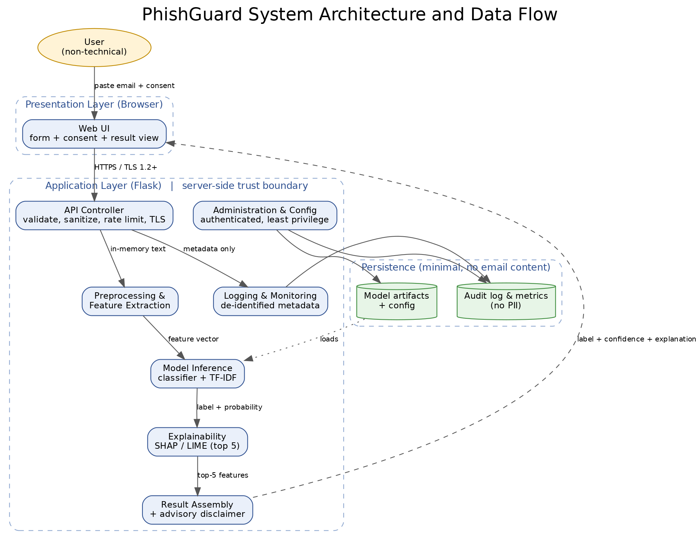
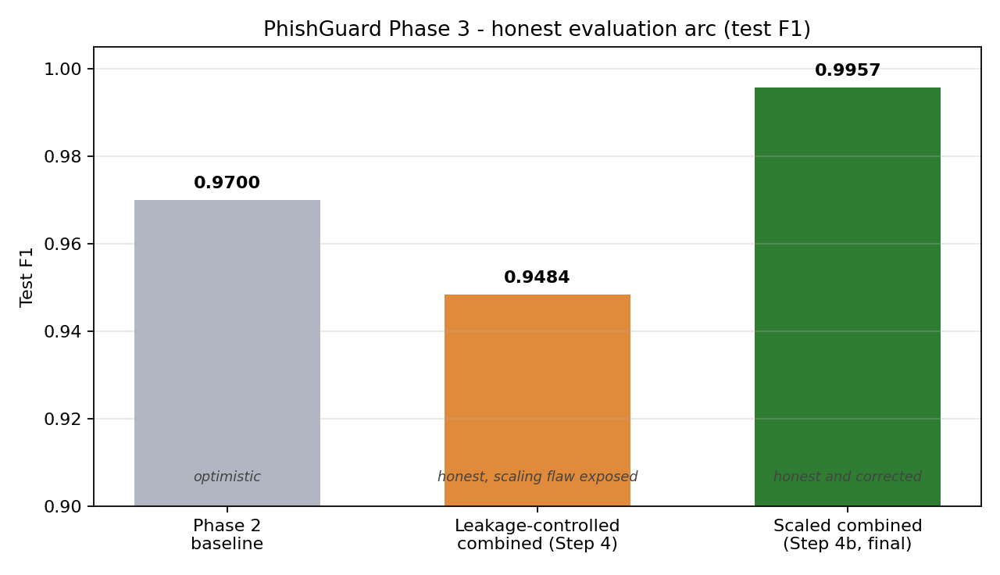
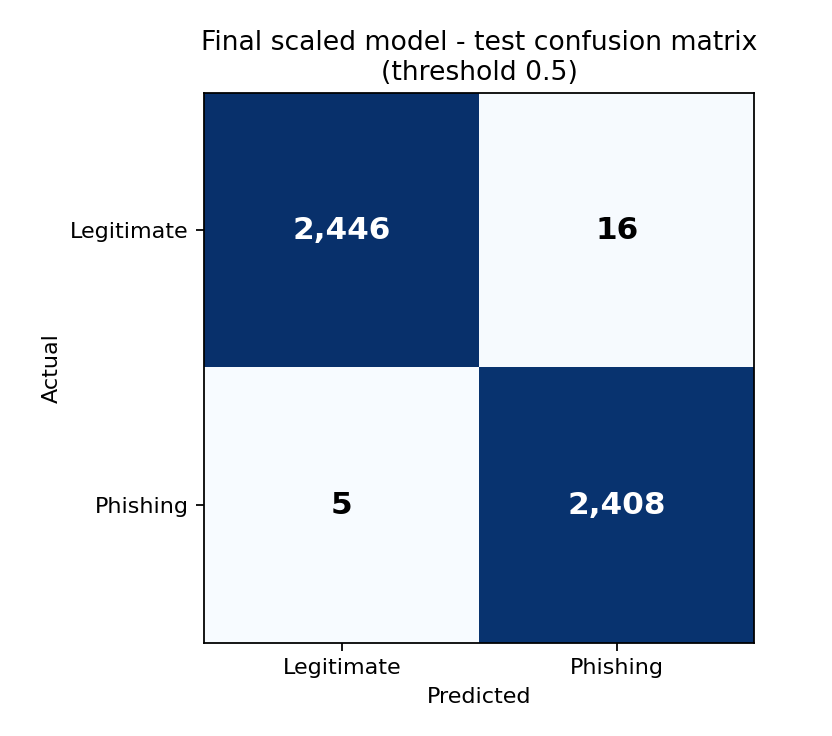
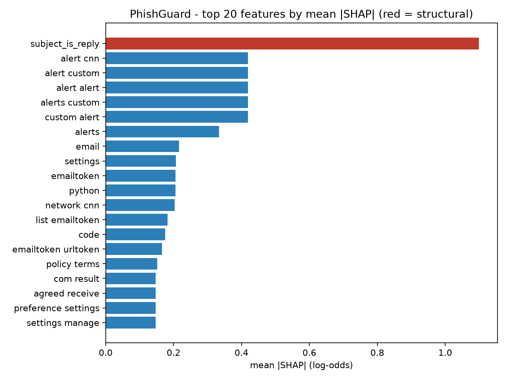

# PhishGuard

[](https://github.com/Hassanolowofela/PhishGuard-Capstone/actions/workflows/ci.yml)

**PhishGuard is an interpretable, web based machine learning tool that checks an
email and tells you whether it is Safe, a Scam, or a Malware-delivery attempt,
with a confidence score and plain-language reasons.** It is built as an MSIT
capstone, and it processes email in memory only, so nothing you submit is stored.

<p align="center">
  
</p>

## What it does

- Paste an email (sender, subject, and body) and get an instant **Safe, Scam, or
  Malware** verdict with a confidence score.
- Read **plain-language red flags** that explain the decision (urgency language,
  links, money requests, lookalike senders) and a recommended action.
- **Transparent by design:** the model is a simple, interpretable classifier, and
  every prediction is explained.
- **Private by design:** email is processed in memory and is never stored.

## The web application

Paste an email and PhishGuard returns a verdict, a confidence donut, per-class
probabilities, red flags, and a recommended action. It also has one-click Safe,
Scam, and Malware examples, a light and dark theme, and an in-memory session
history that clears when the tab closes.

Run it locally:

```bash
# from the project root, in your virtual environment
python 20_train_multiclass.py          # one time: builds the model
pip install -r webapp/requirements.txt
cd webapp
python app.py                          # then open http://127.0.0.1:5000
```

See **[webapp/README.md](webapp/README.md)** for full details.

## How it works

PhishGuard uses a layered client and server design. The browser collects the
email and consent, a Flask API validates the request and runs preprocessing,
inference, and explanation, and only model artifacts are persisted. Email content
is held in memory and discarded after the response.

Under the hood it combines **18 interpretable structural features** (link counts,
urgency words, money symbols, and so on) with a **5,000 term TF-IDF**
representation, fed to a calibrated linear classifier. Because the model is
linear, the "why" shown to the user is an exact attribution over its features,
the same quantity SHAP reports.

## Results (honest evaluation)

The project treats evaluation as a first-class concern. The binary phishing model
went through a leakage audit and a feature-scaling fix, and the numbers below are
measured on leakage-controlled, untouched test sets.

| Stage | Test F1 | Note |
|-------|--------:|------|
| Early in-pipeline baseline | ~0.97 | Optimistic: no leakage control, unscaled features |
| Leakage-controlled combined | 0.9484 | Honest, but exposed a feature-scaling flaw |
| Scaled combined (final binary) | **0.9957** | Honest and correct |

The Phase 4 three-class model (Safe, Scam, Malware) reaches a leakage-controlled
**macro-F1 of about 0.93**, with Safe and Scam strong and Malware the weakest
(a small-data proof of concept that reads malware-lure wording, not attachments).

<p align="center">
  
  
</p>
<p align="center">
  
</p>

## Documentation

| Document | What it covers |
|----------|----------------|
| [Proposal](docs/PROPOSAL.md) | Problem, scope, SMART goals, and the ethics and security review |
| [Software Design Document](docs/SDD.md) | Architecture, modules, requirements, and ethics and security by design |
| [Phase 2 report](Phase2_Report.md), [walkthrough](docs/WALKTHROUGH.md) | Data pipeline: acquire, clean, and feature-engineer the corpus |
| [Phase 3 report](docs/PHASE3_REPORT.md), [walkthrough](docs/PHASE3_WALKTHROUGH.md) | Model development and honest, leakage-controlled evaluation |
| [Phase 4 report](docs/PHASE4_REPORT.md) | The web application and the Safe/Scam/Malware classifier |
| [Web app README](webapp/README.md) | How to run the app and how the inference works |

## Repository structure

```
.
├── 01_acquire_and_validate.py ... 11_verify_reply_signal.py   # Phase 2 and 3 pipeline
├── 20_train_multiclass.py                                     # Phase 4 Safe/Scam/Malware model
├── webapp/                     # Flask web application (app, inference, features, UI)
├── tests/                      # unit tests, run in CI
├── docs/                       # proposal, SDD, phase reports and walkthroughs
├── design/                     # architecture diagram and design notes
├── data/                       # small reviewable artifacts and per-step JSON reports
├── models/                     # fitted models (large files are gitignored)
├── screenshots/                # figures used in the documentation
├── .github/workflows/ci.yml    # continuous integration pipeline
├── Dockerfile                  # container image for deployment
├── requirements.txt
└── README.md                   # this file
```

The numbered scripts run in order: **01 to 03** build the Phase 2 data pipeline,
**04 to 11** are the Phase 3 modeling and evaluation steps, and **20** trains the
Phase 4 three-class model. Each writes a JSON report into `data/`, so every result
in the docs is reproducible.

## Continuous integration and delivery

Every push and pull request runs a GitHub Actions pipeline
(`.github/workflows/ci.yml`) that installs the dependencies, lints the code with
ruff, byte-compiles every Python file so a syntax error cannot reach `main`, runs
the unit tests, and checks the documentation for stray dashes. The unit tests in
`tests/` cover the parts that do not need model artifacts: the text cleaning and
the 18 structural features in `webapp/features.py`, the combined feature vector
width, and the sender heuristics in `webapp/inference.py`.

For delivery, a `Dockerfile` builds a consistent image and serves the app with
gunicorn, so PhishGuard runs the same way on any machine or free tier host. Small,
frequently merged changes are automatically built and tested before they reach
`main`.

## Development phases

- [x] Phase 1 - Initiation and planning ([proposal](docs/PROPOSAL.md))
- [x] Phase 2 - Data acquisition and preparation ([report](Phase2_Report.md))
- [x] Phase 3 - Model development ([report](docs/PHASE3_REPORT.md))
- [x] Phase 4 - Web application ([report](docs/PHASE4_REPORT.md), [app](webapp/))
- [ ] Phase 5 - Testing and evaluation
- [ ] Phase 6 - Documentation and delivery

## Dataset and license

The binary pipeline uses the CEAS_08 component of the curated *Phishing Email
Dataset* (CC BY-SA 4.0). The three-class model uses the *Multiclass NLP Dataset
for Phishing and Social Engineering Threat Detection* (Zenodo, CC BY 4.0). Please
cite:

> Al-Subaiey, A., Al-Thani, M., Alam, N. A., Antora, K. F., Khandakar, A., & Zaman,
> S. A. U. (2024). *Novel interpretable and robust web-based AI platform for phishing
> email detection.* arXiv. https://arxiv.org/abs/2405.11619

> Engineering Ingegneria Informatica Spa (2025). *Multiclass NLP Dataset for Phishing
> and Social Engineering Threat Detection* [Data set]. Zenodo.
> https://doi.org/10.5281/zenodo.15235123
