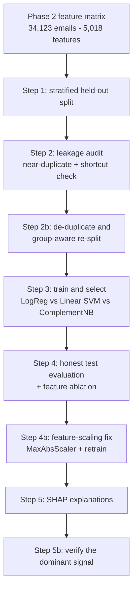

# PhishGuard - Phase 3: Model Development and Honest Evaluation

This report documents Phase 3 of the PhishGuard capstone: turning the Phase 2
feature matrix into a trained, evaluated, and explainable phishing classifier.
The emphasis throughout is on **methodological honesty**. Rather than reporting the
first high accuracy number the pipeline produced, Phase 3 stress-tests that number,
finds the ways it was optimistic, corrects them, and reports results that would hold
up on data the model has never seen.

Every step below is a committed script (`04_*.py` through `11_*.py`) with a matching
machine-readable report in `data/`. Anyone can re-run the pipeline and reproduce the
figures quoted here.

---

## Why a rigorous pass was needed

At the end of Phase 2 an in-pipeline cross-validation baseline on the combined
features reached roughly 0.97 accuracy and F1. That number was encouraging, but it
was produced without two safeguards that matter for a security tool:

1. **Leakage control.** The dataset contains many near-duplicate emails (forwarded
   threads, re-sent campaigns). If a near-twin of a test email sits in the training
   set, the model can look brilliant by memorizing rather than generalizing.
2. **A truly held-out test set.** Cross-validation scores are useful for model
   selection but are easy to over-read as final performance.

Phase 3 rebuilds the evaluation from the ground up to remove both risks, and in doing
so it uncovered a genuine feature-engineering flaw that Phase 2 had hidden.

---

## Pipeline at a glance

---

## Step 1 - A held-out split (`04_split_data.py`)

The 34,123 emails (49.51% phishing, 5,018 features) were split 70/15/15 into train,
validation, and test with stratification on the label and a fixed seed (42).

| Split | Emails | Phishing % |
|-------|-------:|-----------:|
| Train | 23,885 | 49.51 |
| Validation | 5,119 | 49.50 |
| Test | 5,119 | 49.50 |

Index-level integrity checks confirmed zero overlap between any two splits. The test
set was then set aside and not touched again until Step 4.

Output: `data/04_split_report.json`.

---

## Step 2 - Leakage audit (`05_leakage_audit.py`)

Two questions were asked of the fresh split.

**Are there near-duplicate emails bridging train and test?** Using cosine similarity
on L2-normalized TF-IDF vectors, the audit found no exact duplicates but a large
near-duplicate population: **958 of 5,119 test emails (18.7%) had a training email at
similarity 0.95 or higher**, and 297 (5.8%) at 0.99 or higher. The validation set
showed the same pattern (19.1%). This is exactly the leakage that can inflate a naive
score.

**Is any single structural feature a giveaway shortcut?** The audit ranked the 18
structural features by univariate ROC-AUC. The strongest were `body_char_len` (0.928),
`body_word_count` (0.919), and `num_digits` (0.848). These are informative but none is
a perfect separator, so no feature was dropped; they were simply flagged for
monitoring in the explainability step.

Output: `data/05_leakage_report.json`.

---

## Step 2b - De-duplicate and re-split by group (`06_dedupe_and_resplit.py`)

To remove the leakage, near-duplicate emails were clustered so that an email and all
of its near-twins are treated as one **group**, and the split was redone so that a
whole group lands entirely in train, or validation, or test, never split across them.

Near-duplicate edges were built from each email's top 25 neighbors at similarity 0.95
and above, then connected components produced the groups. The corpus formed 28,500
clusters; 1,578 were multi-member, covering 7,201 emails, with the largest single
cluster holding 1,376 near-identical emails. A group-aware stratified split then
produced:

| Split | Emails | Phishing % |
|-------|-------:|-----------:|
| Train | 24,374 | 49.51 |
| Validation | 4,874 | 49.51 |
| Test | 4,875 | 49.50 |

Verification confirmed the fix: **zero shared groups across splits and zero test
emails within 0.95 similarity of any training email** (down from 958). This clean
split is used for all downstream training and evaluation.

Output: `data/06_dedupe_report.json`.

---

## Step 3 - Train and select (`07_train_and_select.py`)

Three interpretable, well-understood classifiers were tuned with grid search and
5-fold cross-validation on the clean training set, then compared on validation.

| Model | Val F1 | Val ROC-AUC | Val recall |
|-------|-------:|------------:|-----------:|
| Logistic Regression | **0.9485** | 0.9954 | 0.9876 |
| Linear SVM | 0.9316 | 0.9923 | 0.9880 |
| Complement Naive Bayes | 0.8678 | 0.9092 | 0.9673 |

Logistic Regression won on F1 and produces calibrated, sign-readable coefficients,
which supports the project's explainability goal. It was calibrated (sigmoid, 5-fold)
and carried forward. The test set remained untouched.

Output: `data/07_model_selection_report.json`.

---

## Step 4 - Honest test evaluation and ablation (`08_evaluate.py`)

The calibrated model was evaluated once on the held-out clean test set.

| Threshold | Accuracy | Precision | Recall | F1 | False-positive rate |
|-----------|---------:|----------:|-------:|----:|--------------------:|
| Default 0.5 | 0.9555 | 0.9256 | 0.9896 | 0.9565 | 0.078 |
| Tuned 0.775 | 0.9807 | 0.9778 | 0.9834 | 0.9806 | 0.022 |

Two diagnostics accompanied the headline numbers:

**Leakage comparison.** Re-scoring on the old leaky split versus the clean split
changed F1 by only about half a point (0.9484 clean versus 0.9429 leaky). This is a
reassuring result in itself: the linear model was not heavily memorizing duplicates.
The clean split remains the correct basis for reporting.

**Feature ablation.** This is where a problem surfaced. Comparing feature families:

| Features | Test F1 |
|----------|--------:|
| Structural only (18) | 0.9300 |
| TF-IDF only (5,000) | **0.9948** |
| Combined (5,018) | 0.9484 |

The combined model performed **worse** than TF-IDF alone. Adding the structural
features was hurting the model, which should never happen if they are handled
correctly.

Output: `data/08_evaluation_report.json`.

---

## Step 4b - The feature-scaling fix (`09_rescale_and_retrain.py`)

The cause was scale. The 18 structural features have large, unscaled magnitudes (a
body length can be thousands of characters) sitting next to TF-IDF values between 0
and 1. In a regularized linear model the large-magnitude features dominate the penalty
and distort the fit. Wrapping the model in a `MaxAbsScaler` puts every feature on a
comparable scale while preserving sparsity.

Retrained and re-evaluated on the same untouched test set:

| Metric | Value |
|--------|------:|
| Accuracy | 0.9957 |
| Precision | 0.9934 |
| Recall | 0.9979 |
| F1 | 0.9957 |
| False-positive rate | 0.0065 |
| ROC-AUC | 0.9997 |

Confusion matrix at the default threshold: 2,446 true negatives, 16 false positives,
5 false negatives, 2,408 true positives. The before-and-after on the combined model is
stark:

| Combined model | Test F1 |
|----------------|--------:|
| Unscaled (Step 4) | 0.9484 |
| Scaled (Step 4b) | **0.9957** |

And the scaled ablation confirms the fix: combined (0.9957) now beats structural-only
(0.9344) and matches TF-IDF-only (0.9965) while adding the interpretable features back
in. This is the production candidate model.

Output: `models/09_classifier_scaled.joblib`, `data/09_rescale_report.json`.

---

## Step 5 - Explainability with SHAP (`10_explain.py`)

Because the final model is linear, `shap.LinearExplainer` gives exact Shapley values
cheaply. SHAP attributions are in log-odds space, where a positive value pushes an
email toward "phishing".

The headline: **TF-IDF content drives about 95% of the decision weight; the 18
structural features contribute roughly 4.7% of total importance.** This is consistent
with the ablation and is a healthy result: the model reasons mainly from the words of
the email, with the structural signals as a secondary, human-readable layer.

Among the structural features, `subject_is_reply` (whether the subject starts with
Re:/Fw:/Fwd:) dominates, followed at a distance by `has_url` and `has_money_symbol`.
The strongest content features are alert- and newsletter-style bigrams. Per-email
explanations behave sensibly, for example a confident phishing email is driven by
its lexical content while a confident legitimate email is pushed down by looking like
a reply and by low URL counts.

Outputs: `data/10_shap_report.json`, `data/10_shap_top_features.png`,
`data/10_shap_beeswarm.png`.

---

## Step 5b - Verifying the dominant signal (`11_verify_reply_signal.py`)

Because one structural feature dominated the others, it was checked directly. Is
`subject_is_reply` a robust cue, or an accident of how this dataset was built?

**Association.** In this corpus, reply-style subjects are strongly tied to legitimate
mail:

| Subject type | Share of corpus | Phishing rate |
|--------------|----------------:|--------------:|
| Reply (Re:/Fw:/Fwd:) | 28.5% | 1.8% |
| Non-reply | 71.5% | 68.5% |

The correlation (phi) with phishing is -0.60, and reply-subject emails are about 38
times less likely to be phishing. Of 16,893 phishing emails, only 174 carry a
reply-style subject.

**Robustness.** The feature is real but it is a **corpus artifact**: the legitimate
half of CEAS_08 is reply-heavy, which is a property of the data source, not a law of
phishing. To confirm the model does not depend on this shortcut, it was retrained with
the feature removed:

| Model | Accuracy | F1 | ROC-AUC |
|-------|---------:|----:|--------:|
| Full | 0.9957 | 0.9957 | 0.9997 |
| Without `subject_is_reply` | 0.9965 | 0.9965 | 0.9998 |

Removing the feature does not hurt performance; it nudges up by a rounding-level
amount. The model's accuracy comes from email content, and the reply cue is redundant.
This matters for the project's security framing: a real attacker who prepends "Re:" to
a subject gains nothing here, because the deployed model does not lean on that signal.

Output: `data/11_reply_signal_report.json`.

---

## The evaluation arc, end to end

| Stage | Test F1 | What it represents |
|-------|--------:|--------------------|
| Phase 2 in-pipeline baseline | ~0.97 | Optimistic: no leakage control, unscaled features |
| Leakage-controlled combined (Step 4) | 0.9484 | Honest, but exposed a feature-scaling flaw |
| Scaled combined (Step 4b, final) | **0.9957** | Honest and correct, exceeds the original number |

The final figure is higher than the Phase 2 baseline, but the difference is that it is
now trustworthy: measured on a leakage-controlled, group-aware, untouched test set,
with a model whose features are handled correctly and whose reasoning has been audited.

---

## Limitations and future work

- **Single corpus.** All results are on CEAS_08. The `subject_is_reply` finding is a
  concrete example of a signal that could weaken or flip on a different email source.
  A cross-corpus or temporal generalization test (train on one period or source,
  test on another) is the most valuable next experiment.
- **Linear model.** A linear classifier was chosen for interpretability and strong
  performance. A non-linear model could be benchmarked, weighed against the loss in
  explainability.
- **Threshold policy.** The default threshold favors recall (few missed phishing
  emails) at the cost of some false positives. The tuned threshold trades this off.
  The operating point should be set by the deployment context in Phase 4.

---

## Reproducibility

| Step | Script | Report |
|------|--------|--------|
| 1 | `04_split_data.py` | `data/04_split_report.json` |
| 2 | `05_leakage_audit.py` | `data/05_leakage_report.json` |
| 2b | `06_dedupe_and_resplit.py` | `data/06_dedupe_report.json` |
| 3 | `07_train_and_select.py` | `data/07_model_selection_report.json` |
| 4 | `08_evaluate.py` | `data/08_evaluation_report.json` |
| 4b | `09_rescale_and_retrain.py` | `data/09_rescale_report.json` |
| 5 | `10_explain.py` | `data/10_shap_report.json` (+ charts) |
| 5b | `11_verify_reply_signal.py` | `data/11_reply_signal_report.json` |

All scripts use a fixed seed (42) and read the artifacts produced by the previous
step, so the full arc is reproducible from the Phase 2 feature matrix.
