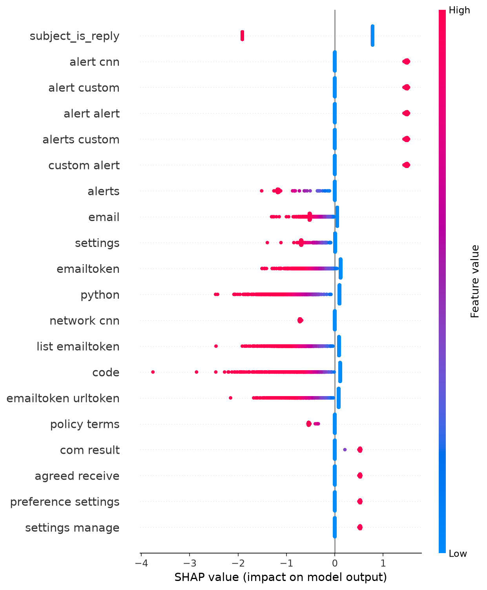

# PhishGuard - Phase 3 Walkthrough (step by step)

This is a hands-on, run-it-yourself guide to Phase 3: model development and honest
evaluation. It complements the narrative in
**[PHASE3_REPORT.md](PHASE3_REPORT.md)** by showing the exact command for each step,
what to expect on screen, and the figures each step produces.

Each step below has a slot for your own VS Code terminal screenshot. Save the capture
at the path shown and it will appear inline. The result figures (evaluation arc,
confusion matrix, SHAP charts) are generated by the scripts and are already included.

> Note on placeholders: image links that point to `screenshots/phase3/stepN_terminal.png`
> are intentionally empty until you drop your own screenshots in. Everything else
> renders as-is.

---

## Prerequisites

Phase 3 reads the artifacts produced by Phase 2 (`data/03_combined.npz`,
`data/03_labels.npy`, `data/03_structural.csv`, `data/03_tfidf.npz`, and
`models/tfidf_vectorizer.joblib`). Run Phase 2 first if those files are not present.

### Environment setup

```bash
# from the project root, in your virtual environment
python -m venv .venv
.\.venv\Scripts\activate        # Windows PowerShell
pip install -r requirements.txt
pip install shap matplotlib     # used by the explainability and figure steps
```

> **[Screenshot placeholder]** Save your terminal capture as
> `screenshots/phase3/setup_terminal.png`
>
> 

Every script uses a fixed random seed (42), so your numbers should match the ones
shown here.

---

## Step 1 - Held-out split

Splits the 34,123 emails 70/15/15 into train, validation, and test, stratified on the
label, and checks that no email appears in more than one split.

```bash
python 04_split_data.py
```

Expected output (abridged):

```
train: n=23885  phish=49.51%
val:   n=5119   phish=49.50%
test:  n=5119   phish=49.50%
integrity: train_val_overlap=0  train_test_overlap=0  val_test_overlap=0
```

> **[Screenshot placeholder]** `screenshots/phase3/step1_terminal.png`
>
> 

Writes `data/04_split_report.json`.

---

## Step 2 - Leakage audit

Checks for near-duplicate emails that bridge train and test (which would inflate the
score) and for any single structural feature that acts as a giveaway shortcut.

```bash
python 05_leakage_audit.py
```

Expected output (abridged):

```
exact duplicates: 0
near-duplicate test vs train:  >=0.95 = 958 (18.7%)   >=0.99 = 297 (5.8%)
top structural features by univariate AUC:
  body_char_len 0.928 | body_word_count 0.919 | num_digits 0.848
```

> **[Screenshot placeholder]** `screenshots/phase3/step2_terminal.png`
>
> 

Writes `data/05_leakage_report.json`. The 18.7% near-duplicate rate is the problem the
next step fixes.

---

## Step 2b - De-duplicate and re-split by group

Clusters near-duplicate emails into groups and re-splits so a whole group stays inside
one split. This removes the leakage found in Step 2.

```bash
python 06_dedupe_and_resplit.py
```

Expected output (abridged):

```
clusters: 28500  multi-member: 1578  largest cluster: 1376
clean split -> train 24374 | val 4874 | test 4875  (~49.5% phishing)
verify test vs train: count_ge_0.95 = 0   group leakage: 0
```

> **[Screenshot placeholder]** `screenshots/phase3/step2b_terminal.png`
>
> 

Writes `data/06_dedupe_report.json`. The near-duplicate count across splits is now
zero.

---

## Step 3 - Train and select

Tunes and compares Logistic Regression, Linear SVM, and Complement Naive Bayes with
5-fold cross-validation, then picks the best on validation and calibrates it.

```bash
python 07_train_and_select.py
```

Expected output (abridged):

```
logreg        val_f1=0.9485  val_roc_auc=0.9954
linear_svm    val_f1=0.9316  val_roc_auc=0.9923
complement_nb val_f1=0.8678  val_roc_auc=0.9092
selected: logreg (C=1), calibrated sigmoid
```

> **[Screenshot placeholder]** `screenshots/phase3/step3_terminal.png`
>
> 

Writes `models/07_classifier.joblib` and `data/07_model_selection_report.json`.

---

## Step 4 - Honest test evaluation and ablation

Scores the calibrated model once on the untouched test set and runs a feature ablation.

```bash
python 08_evaluate.py
```

Expected output (abridged):

```
test default 0.5:  acc=0.9555  precision=0.9256  recall=0.9896  f1=0.9565
ablation:  structural=0.9300  tfidf=0.9948  combined=0.9484
```

> **[Screenshot placeholder]** `screenshots/phase3/step4_terminal.png`
>
> 

Writes `data/08_evaluation_report.json`. The combined model scoring below TF-IDF alone
is the red flag that motivates Step 4b.

---

## Step 4b - Feature-scaling fix

Wraps the model in a `MaxAbsScaler` so the large-magnitude structural features stop
dominating the regularized linear model, then retrains and re-evaluates.

```bash
python 09_rescale_and_retrain.py
```

Expected output (abridged):

```
best_C=10
test default 0.5:  acc=0.9957  precision=0.9934  recall=0.9979  f1=0.9957  fpr=0.0065
before/after combined:  unscaled f1=0.9484  ->  scaled f1=0.9957
```

> **[Screenshot placeholder]** `screenshots/phase3/step4b_terminal.png`
>
> 

Writes `models/09_classifier_scaled.joblib` and `data/09_rescale_report.json`. This is
the production candidate model. The two figures below summarize the outcome.

**The evaluation arc (test F1 across the phase):**


**Final model test confusion matrix (threshold 0.5):**


---

## Step 5 - Explainability with SHAP

Computes exact SHAP attributions for the linear model and writes the importance
charts.

```bash
python 10_explain.py
```

Expected output (abridged):

```
base_value_logodds=-1.0268
structural share of total importance = 4.74%
top structural: subject_is_reply (dominant), then has_url, has_money_symbol
```

> **[Screenshot placeholder]** `screenshots/phase3/step5_terminal.png`
>
> 

Writes `data/10_shap_report.json` and the two charts below.

**Top features by mean absolute SHAP (structural in red):**


**SHAP beeswarm over the test set:**



---

## Step 5b - Verify the dominant signal

Checks whether `subject_is_reply` is a robust cue or a corpus artifact, and confirms
the model does not depend on it.

```bash
python 11_verify_reply_signal.py
```

Expected output (abridged):

```
reply subjects:     28.5% of corpus, phishing rate 1.8%
non-reply subjects: 71.5% of corpus, phishing rate 68.5%
phi correlation with phishing = -0.60
robustness: full f1=0.9957  ->  without subject_is_reply f1=0.9965
```

> **[Screenshot placeholder]** `screenshots/phase3/step5b_terminal.png`
>
> 

Writes `data/11_reply_signal_report.json`. Removing the feature does not hurt the
model, which confirms it is redundant and adversarially harmless here.

---

## Run the whole phase at once

```bash
python 04_split_data.py
python 05_leakage_audit.py
python 06_dedupe_and_resplit.py
python 07_train_and_select.py
python 08_evaluate.py
python 09_rescale_and_retrain.py
python 10_explain.py
python 11_verify_reply_signal.py
```

Each script reads the previous step's artifacts and writes a JSON report in `data/`,
so the full Phase 3 arc is reproducible end to end from the Phase 2 feature matrix.

---

## Adding your own screenshots

To fill the placeholders, capture each terminal run in VS Code and save the images
into `screenshots/phase3/` using the exact filenames referenced above
(`setup_terminal.png`, `step1_terminal.png`, and so on). Once committed, they will
render in place of the empty slots.
