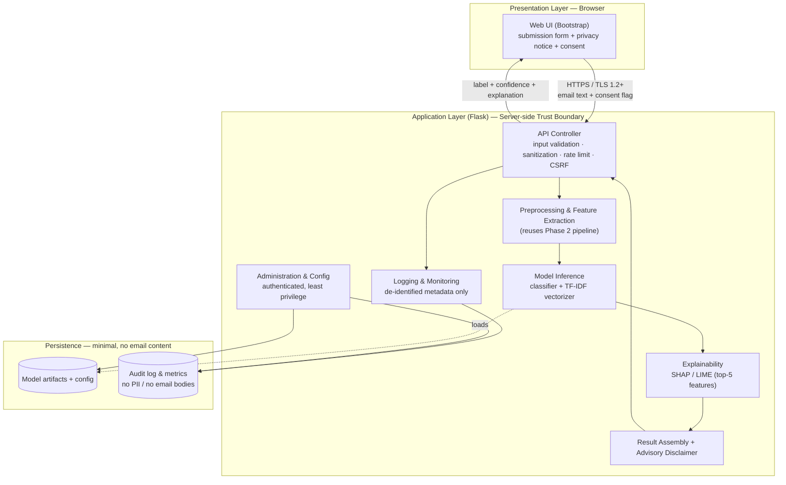
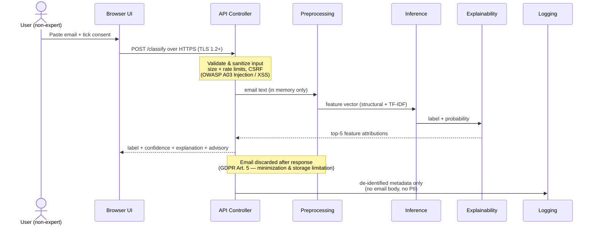
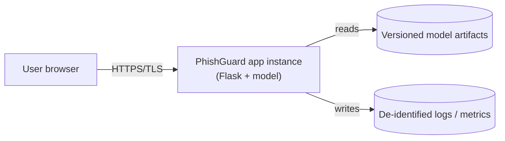

# Software Design Document (SDD) — PhishGuard

**Project:** A Web-Based Machine-Learning Tool for Phishing Email Detection
**Course:** MSIT 5910 — Capstone Project
**Author:** Hassan Olowofela
**Version:** 1.0
**Status:** Design (Phase 2 data pipeline implemented; web application designed for Phases 3–4)

> Companion documents: the [Phase 1 proposal](PROPOSAL.md) sets out the problem,
> scope, and goals; the [Phase 2 walkthrough](WALKTHROUGH.md) records the implemented
> data pipeline; the repository [README](../README.md) summarizes the project. This SDD
> specifies **how** PhishGuard is designed, with ethics and security treated as
> foundational architectural drivers rather than add-ons.

## Contents

1. [Introduction](#1-introduction)
2. [System Overview](#2-system-overview)
3. [Design Considerations](#3-design-considerations)
4. [System Architecture](#4-system-architecture)
5. [Data Design and Data Flow](#5-data-design-and-data-flow)
6. [Module / Component Specifications](#6-module--component-specifications)
7. [Interface Design](#7-interface-design)
8. [Embedding Ethical and Security Principles in the Architecture](#8-embedding-ethical-and-security-principles-in-the-architecture)
9. [Deployment View](#9-deployment-view)
10. [Requirements Traceability](#10-requirements-traceability)
11. [References](#11-references)

---

## 1. Introduction

### 1.1 Purpose

This document describes the software design of **PhishGuard**, a web-based
machine-learning tool that classifies a submitted email as *phishing* or *legitimate*,
explains the key features behind each decision, and does so through an interface usable
by non-technical people. It translates the Phase 1 proposal's requirements into a
concrete architecture, module specification, and data-flow design, and it defines the
security and privacy safeguards built into that design.

### 1.2 Scope

The design covers the full prototype: a web client, an application/API layer, the
machine-learning inference and explainability services, and the supporting logging and
administration functions. The Phase 2 data pipeline (dataset acquisition, cleaning, and
feature engineering) is already implemented in this repository and is reused at
inference time; this SDD focuses on the remaining runtime system. Out of scope, per the
proposal, are live mail-server integration, attachment sandboxing, production-scale
hardening, and multi-language detection.

### 1.3 Definitions, Acronyms, and Abbreviations

| Term | Meaning |
|------|---------|
| TF-IDF | Term Frequency–Inverse Document Frequency text representation |
| SHAP / LIME | Model-agnostic explainability methods for per-prediction feature attribution |
| PII | Personally Identifiable Information |
| FPR / FNR | False-Positive Rate / False-Negative Rate |
| TLS | Transport Layer Security (HTTPS) |
| CSRF / XSS | Cross-Site Request Forgery / Cross-Site Scripting |
| Process-and-discard | Handling submitted content only in memory and never persisting it |
| SDD | Software Design Document |

### 1.4 References

Standards and frameworks referenced in this design: ISO/IEC 27001:2022 (information
security management), the EU General Data Protection Regulation (GDPR), the OWASP Top 10
(2021), the NIST Cybersecurity Framework 2.0, and the ACM Code of Ethics. Full citations
appear in [Section 11](#11-references).

### 1.5 Guiding Design Principles

PhishGuard is designed around five principles, in priority order: **privacy by design
and by default**, **least privilege**, **transparency and interpretability**,
**fairness**, and **usability for non-experts**. Every architectural decision in this
document is justified against these principles and the quality attributes in
[Section 3.3](#33-architectural-drivers-quality-attributes).

---

## 2. System Overview

PhishGuard lets a user paste or submit the text of a suspicious email and receive, in
under three seconds, a classification (*phishing* / *legitimate*), a confidence score, and
a short, human-readable explanation naming the top features that drove the decision. The
result is explicitly advisory: the tool is a decision aid that keeps a human in the loop,
not an automated gatekeeper.

The system reuses the Phase 2 pipeline at runtime. An incoming email passes through the
same cleaning and feature-extraction logic used in training — HTML is stripped, URLs and
email addresses are replaced with placeholder tokens, and the text is turned into 18
interpretable structural features plus a 5,000-term TF-IDF vector using the serialized
`models/tfidf_vectorizer.joblib`. The trained classifier then produces a probability, and
an explainability component surfaces the top contributing features.

---

## 3. Design Considerations

### 3.1 Assumptions and Dependencies

The system runs on a single application instance (local host or free-tier cloud), uses
only open-source libraries (Python 3, scikit-learn, pandas/NumPy, NLTK/spaCy, SHAP/LIME,
and Flask), and loads pre-trained model artifacts produced by the Phase 2/3 pipeline.
Submitted emails are assumed to be plain text or HTML email bodies, not attachments.

### 3.2 Constraints

Time (eight-week term), budget (free/open-source only), and compute (no dedicated GPU)
constrain the design toward a lightweight, interpretable model served by a small,
auditable web application rather than a large deployed service.

### 3.3 Architectural Drivers (Quality Attributes)

| Quality attribute | Target / rationale |
|-------------------|--------------------|
| Privacy | Submitted emails are never persisted (process-and-discard); no PII at rest |
| Security | Web attack surface hardened against the OWASP Top 10; least-privilege access |
| Interpretability | Every decision is accompanied by the top-5 contributing features |
| Fairness | Performance monitored across email types; FPR/FNR reported, not just accuracy |
| Performance | End-to-end classification in under 3 seconds per request |
| Usability | Single-purpose interface aimed at non-technical users, with clear advisories |

These drivers are the reason the architecture separates a thin, validated request path
from the ML core and pushes sensitive data handling to a single, controllable boundary.

---

## 4. System Architecture

### 4.1 Architectural Style

PhishGuard uses a **layered client–server architecture** with a clear server-side
**trust boundary**. The browser holds no secrets and performs no classification; all
processing occurs server-side within one application boundary, which keeps the attack
surface small and the data-flow easy to reason about. Within the server, responsibilities
are separated into independent modules (controller, preprocessing, inference,
explainability, logging, administration) so that safeguards can be applied at the exact
point where each risk arises.

### 4.2 Architecture Diagram

### 4.3 Component Responsibilities

| Component | Primary responsibility | Key safeguard |
|-----------|------------------------|---------------|
| Web UI | Collect email text, present result and explanation | Consent checkbox + privacy notice; output encoding |
| API Controller | Entry point; validate, sanitize, route requests | Input validation, size/rate limits, CSRF, TLS termination |
| Preprocessing | Clean and vectorize email in memory | No persistence; deterministic, reused-from-training logic |
| Inference | Produce label + calibrated probability | Runs on transient features only |
| Explainability | Compute top-5 feature attributions | Interpretability; supports fairness review |
| Result Assembly | Package label, confidence, explanation, disclaimer | "Advisory only" framing; human-in-the-loop |
| Logging & Monitoring | Record operational metrics and audit events | De-identified metadata only; no email content |
| Administration | Manage model version and view aggregate metrics | Authentication + least-privilege access control |

---

## 5. Data Design and Data Flow

### 5.1 Data Entities

| Entity | Description | Sensitivity | Retention |
|--------|-------------|-------------|-----------|
| Submitted email | Raw text provided by the user | High (may contain PII/credentials) | **None** — discarded after response |
| Feature vector | Structural + TF-IDF representation | Transient, in memory | None |
| Prediction | Label + probability | Low | Not linked to email content |
| Explanation | Top-5 feature attributions | Low | Returned, not stored |
| Operational log | Timestamp, label, latency, status code | Low (de-identified) | Retained for monitoring |
| Model artifacts | Serialized classifier + vectorizer + config | Non-sensitive | Versioned in the repository |

The critical design point is that **the only high-sensitivity entity (the email) is never
written to disk or database**. It exists only in application memory for the duration of a
single request.

### 5.2 Data-Flow Diagram (with safeguards)

### 5.3 Data Lifecycle — Process-and-Discard

Submitted content follows a strict lifecycle: **received over TLS → validated → processed
in memory → result returned → immediately released from memory**. No stage writes the
email to persistent storage, and logging captures only non-identifying operational
metadata. This lifecycle is the single most important privacy decision in the system and
underpins several of the mitigations in [Section 8](#8-embedding-ethical-and-security-principles-in-the-architecture).

### 5.4 Data Classification

Data is classified into three tiers: **transient-sensitive** (the submitted email and its
in-memory derivatives — never persisted, always encrypted in transit); **operational**
(de-identified logs and aggregate metrics — retained, access-controlled); and
**non-sensitive** (versioned model artifacts and configuration). Access controls and
encryption requirements are assigned per tier.

---

## 6. Module / Component Specifications

Each module is specified by its responsibility, inputs, outputs, and the design decisions
that build in security and ethics.

### 6.1 Web Client (Presentation)

- **Responsibility:** Render the submission form, the privacy notice and consent control,
  and the result view (label, confidence, top-5 explanation, advisory disclaimer).
- **Inputs / Outputs:** User-entered email text and consent flag → rendered result.
- **Design decisions:** Holds no secrets and performs no classification; all model output
  is HTML-escaped before rendering to prevent stored/reflected XSS; the consent control
  is required before submission is enabled.

### 6.2 Application Controller / API (Flask)

- **Responsibility:** Single, guarded entry point for all classification requests.
- **Inputs / Outputs:** JSON `{ email_text, consent }` → JSON result object.
- **Design decisions:** Enforces TLS; validates and sanitizes input; applies request
  size limits (to bound resource use), rate limiting (to resist abuse), and CSRF
  protection; verifies the consent flag before any processing occurs; never logs the
  email body.

### 6.3 Preprocessing and Feature Extraction

- **Responsibility:** Convert raw email text into the model's feature representation using
  the exact Phase 2 logic (strip HTML, tokenize URLs/emails, derive 18 structural
  features, apply the saved TF-IDF vectorizer).
- **Design decisions:** Purely in-memory and deterministic; reuses the training-time
  pipeline to avoid train/serve skew; produces no side effects and retains nothing.

### 6.4 Model Inference

- **Responsibility:** Return a label and a calibrated probability for the feature vector.
- **Design decisions:** Loads a versioned, read-only model artifact; operates only on the
  transient feature vector; a tunable decision threshold lets the operator trade off FPR
  against FNR according to the cost of each error.

### 6.5 Explainability

- **Responsibility:** Produce the top-5 features contributing to the individual decision.
- **Design decisions:** Uses model-agnostic attribution (SHAP/LIME); interpretable
  structural features make explanations meaningful to non-experts and provide the raw
  material for fairness auditing.

### 6.6 Result Assembly and Advisory

- **Responsibility:** Package label, confidence, and explanation with a clear advisory
  disclaimer ("this is guidance, not a guarantee — verify before acting").
- **Design decisions:** The advisory framing operationalizes human-in-the-loop
  decision-making and aligns with GDPR expectations around automated processing.

### 6.7 Logging, Monitoring, and Audit

- **Responsibility:** Record operational metrics and security-relevant events.
- **Design decisions:** Logs **de-identified metadata only** (timestamp, predicted label,
  latency, status) — never the email content; administrative and authentication events are
  audit-logged to support detection and incident response.

### 6.8 Administration and Configuration

- **Responsibility:** Manage model versions and view aggregate performance metrics
  (including per-segment FPR/FNR for fairness monitoring).
- **Design decisions:** All administrative functions require authentication and follow
  least privilege; configuration secrets are kept out of source control.

---

## 7. Interface Design

### 7.1 User Interface

A single-page form: a text area for the email, a required consent checkbox linked to the
privacy notice, and a **Check email** action. The result view shows the label, a
confidence indicator, the top-5 contributing features in plain language, and the advisory
disclaimer.

### 7.2 Application Programming Interface

Primary endpoint (illustrative):

| Field | Value |
|-------|-------|
| Method / Path | `POST /api/v1/classify` |
| Transport | HTTPS (TLS 1.2+) only |
| Request body | `{ "email_text": "<string>", "consent": true }` |
| Success response | `{ "label": "phishing", "probability": 0.97, "top_features": [...], "disclaimer": "Advisory only." }` |
| Errors | `400` invalid/oversized input · `403` consent not given · `429` rate limited |

Administrative endpoints (model management, metrics) sit behind authentication and are
not exposed to anonymous users.

### 7.3 External Interfaces

The system consumes versioned model artifacts (`models/tfidf_vectorizer.joblib` plus the
trained classifier) produced by the documented Phase 2/3 pipeline. Training data
provenance and licensing are recorded in the repository, satisfying attribution
obligations.

---

## 8. Embedding Ethical and Security Principles in the Architecture

Ethics and security are **architectural drivers** in PhishGuard, not features bolted on at
the end. This section identifies the principal risks to the architecture and data flow,
shows how specific module-level design decisions mitigate them, discusses the four
cross-cutting concerns (data protection, authentication, informed consent, and
algorithmic fairness), gives a concrete worked example, and maps the design to recognized
standards.

### 8.1 Risk Identification and Analysis

The table analyzes the principal ethical and security risks, locating each in the
architecture or data flow. (Requirement: at least three; six are analyzed here.)

| ID | Risk | Nature | Where it arises (architecture / data flow) | Likelihood | Impact |
|----|------|--------|--------------------------------------------|-----------|--------|
| R1 | Exposure or over-retention of sensitive email content (submitted emails may contain PII, credentials, or confidential business data) | Ethical + Security | Data flow: input handling and any persistence | Medium | High |
| R2 | Injection / cross-site scripting via crafted email text or rendered output | Security | Client ↔ Controller interface; result rendering | Medium | High |
| R3 | Broken access control to the model, logs, or admin functions | Security | Application + persistence layers | Medium | High |
| R4 | Interception of data in transit | Security | Client ↔ Server data flow | Low–Medium | High |
| R5 | Algorithmic bias — disproportionate false positives for certain writing styles/languages | Ethical | Preprocessing + Inference | Medium | Medium–High |
| R6 | Adversarial / LLM-crafted evasion of the classifier | Security + Ethical | Inference | Medium | Medium |

A supporting concern, **vulnerable or outdated dependencies (R7)**, spans the whole stack
and is handled as an operational safeguard (dependency patching) rather than a single
component.

### 8.2 How the Design Mitigates Each Risk

Each risk is addressed by a deliberate design decision or safeguard in a specific module:

| Risk | Design decision / safeguard | Module(s) |
|------|-----------------------------|-----------|
| R1 | **Process-and-discard**: emails are handled only in memory and never persisted; logging records de-identified metadata only; data minimization by default | Preprocessing, Controller, Logging |
| R2 | Input validation and sanitization at the Controller; output encoding/HTML-escaping in the UI; size limits | Controller, Web UI |
| R3 | Authentication on administrative endpoints; least-privilege separation; read-only model artifacts; audit logging | Administration, Logging |
| R4 | Mandatory TLS 1.2+ for all traffic; no sensitive data in URLs; secure cookies | Controller, Web UI |
| R5 | Fairness monitoring — per-segment FPR/FNR reported; de-identified/representative training data; interpretable features expose biased signals; advisory framing keeps a human in the loop | Explainability, Inference, Administration |
| R6 | Advisory (not gatekeeping) positioning; interpretable structural features that are harder to game than pure lexical cues; monitoring for drift; adversarial robustness flagged as future work | Result Assembly, Inference, Logging |
| R7 | Pinned, regularly patched dependencies; minimal library surface | Build / deployment |

### 8.3 Key Design Aspects

#### 8.3.1 Data Protection

Sensitive input is protected in transit (TLS 1.2+) and, wherever any operational data is
retained, at rest (e.g., AES-256). The strongest protection is architectural: the
process-and-discard lifecycle means there is **no sensitive data at rest to breach** in
the first place. This realizes GDPR data minimization and storage limitation (Art. 5) and
data protection by design and by default (Art. 25), and aligns with ISO/IEC 27001:2022
cryptography and privacy controls (e.g., A.8.24, A.5.34).

#### 8.3.2 Authentication Mechanisms

Anonymous users may submit an email for classification, but every privileged action —
managing model versions, viewing logs and metrics — requires authentication and follows
least privilege. This directly answers OWASP A01 (Broken Access Control) and A07
(Identification and Authentication Failures) and maps to ISO/IEC 27001:2022 access-control
and secure-authentication controls (e.g., A.5.15, A.8.5). Administrative and
authentication events are audit-logged to support detection.

#### 8.3.3 Informed User Consent and Transparency

Before an email can be submitted, the UI presents a plain-language privacy notice
explaining what is processed, that nothing is stored, and that the result is advisory; the
user must give explicit consent. This provides a lawful basis and satisfies transparency
duties under GDPR (Art. 6, 7, and 13) and reflects the ACM Code of Ethics' emphasis on
honesty and respect for user autonomy.

#### 8.3.4 Fairness in Algorithmic Processing

Because a skewed corpus can cause uneven performance, fairness is engineered in:
performance is reported per email segment (not just as headline accuracy), false-positive
and false-negative rates are tracked because they carry asymmetric human cost, the
explainability module exposes which features drive a decision (making biased signals
visible), and the advisory, human-in-the-loop framing avoids fully automated adverse
decisions — consistent with the spirit of GDPR Art. 22 on automated decision-making.

### 8.4 Concrete Worked Example — The Consent-Gated, Process-and-Discard Submission

Consider the most sensitive operation in the system: a user submitting a real, possibly
confidential email. The design handles it as a single, unified decision that is
simultaneously ethical and secure:

1. The request is accepted **only over TLS 1.2+**, so the content cannot be intercepted in
   transit (OWASP A02 Cryptographic Failures; ISO/IEC 27001:2022 A.8.24 use of
   cryptography).
2. The Controller **requires an explicit consent flag** tied to a plain-language privacy
   notice before any processing begins (GDPR Art. 6 lawful basis; Art. 13 transparency).
3. The email is **validated, processed entirely in memory, and never written to storage**,
   and is released immediately after the response (GDPR Art. 5 data minimization and
   storage limitation; Art. 25 data protection by design and by default).
4. Only **de-identified metadata** is logged (GDPR Art. 5; OWASP A09 handled without
   capturing content).

This one design choice — *consent-gated, TLS-only, process-and-discard* — upholds
**ethical integrity** (user autonomy, transparency, privacy) and **secure operation**
(minimized attack surface, no sensitive data at rest, encrypted transport) at the same
time. It is the clearest illustration that, in PhishGuard, the ethical and secure choice
is the same architectural choice.

### 8.5 Standards and Framework Alignment

| Design decision | ISO/IEC 27001:2022 (Annex A) | GDPR | OWASP Top 10 (2021) | NIST CSF 2.0 |
|-----------------|------------------------------|------|---------------------|--------------|
| TLS-only transport | A.8.24 Cryptography | Art. 32 | A02 Cryptographic Failures | Protect |
| Process-and-discard / minimization | A.5.34 PII protection | Art. 5, 25 | A04 Insecure Design | Protect / Govern |
| Input validation & output encoding | A.8.28 Secure coding | Art. 32 | A03 Injection | Protect |
| Authentication & least privilege | A.5.15, A.8.5 | Art. 32 | A01, A07 | Protect |
| De-identified logging & monitoring | A.8.15, A.8.16 | Art. 5 | A09 Logging & Monitoring Failures | Detect / Respond |
| Dependency patching | A.8.8 Vulnerability mgmt | Art. 32 | A06 Vulnerable Components | Identify / Protect |
| Consent & transparency | A.5.34 | Art. 6, 7, 13 | — | Govern |
| Fairness monitoring & human-in-loop | — | Art. 22 | — | Govern |

Together these mappings show that each safeguard is anchored in at least one recognized
standard, and that data protection, authentication, consent, and fairness are addressed
by design rather than retrofitted.

---

## 9. Deployment View

The prototype deploys as a single application instance (local host or a free-tier cloud
service) behind TLS, loading versioned model artifacts at start-up. A minimal footprint —
one guarded entry point, no user-data store, patched dependencies — keeps the deployment
both auditable and cheap, consistent with the project's budget and security goals.

---

## 10. Requirements Traceability

| Proposal goal | Design element that satisfies it |
|---------------|----------------------------------|
| Accurate classifier (≥95% acc / F1) | Inference module over Phase 2 features (baseline ~0.97) |
| Web interface, <3s response | Presentation layer + lightweight Flask controller |
| Explainability (top-5 features) | Explainability module (SHAP/LIME) + interpretable features |
| Documented evaluation vs. baseline | Metrics via Administration/Monitoring (FPR/FNR reported) |
| Ethics & security review | Section 8 (risks, mitigations, standards mapping) |

---

## 11. References

Association for Computing Machinery. (2018). *ACM code of ethics and professional conduct.* https://www.acm.org/code-of-ethics

European Parliament & Council of the European Union. (2016). *Regulation (EU) 2016/679 (General Data Protection Regulation).* https://eur-lex.europa.eu/eli/reg/2016/679/oj

International Organization for Standardization. (2022). *ISO/IEC 27001:2022 — Information security, cybersecurity and privacy protection — Information security management systems — Requirements.* https://www.iso.org/standard/27001

National Institute of Standards and Technology. (2024). *The NIST cybersecurity framework (CSF) 2.0* (NIST CSWP 29). U.S. Department of Commerce. https://doi.org/10.6028/NIST.CSWP.29

OWASP Foundation. (2021). *OWASP Top 10:2021.* https://owasp.org/Top10/
