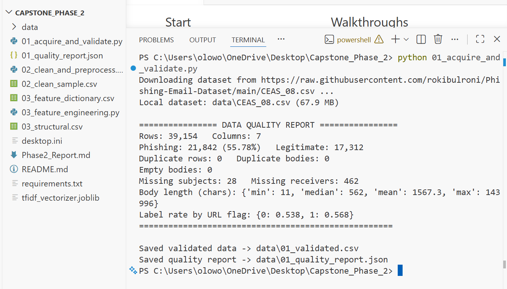
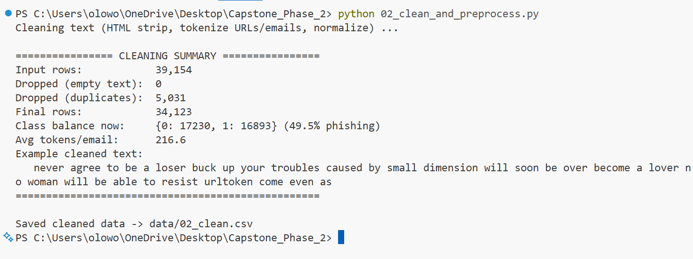
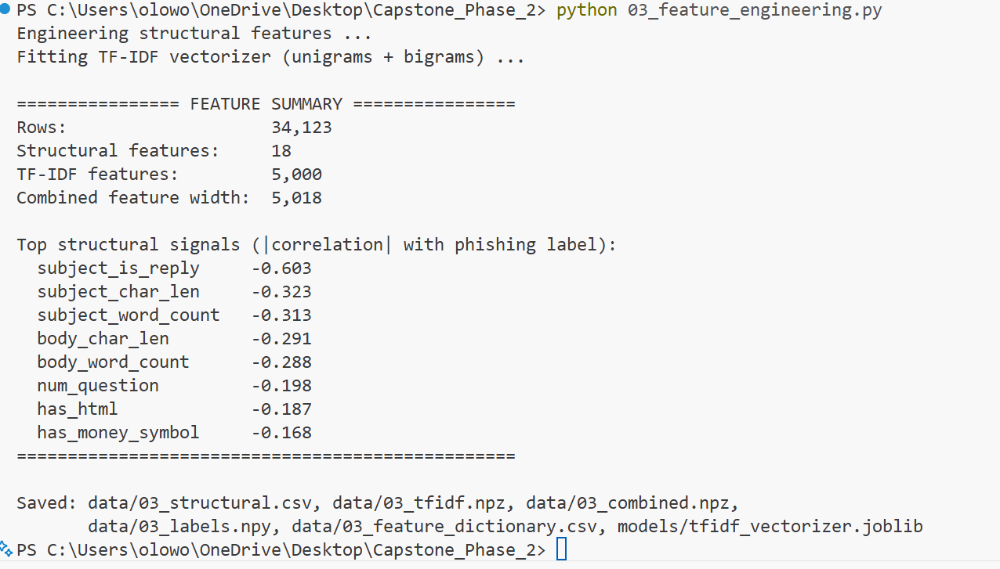
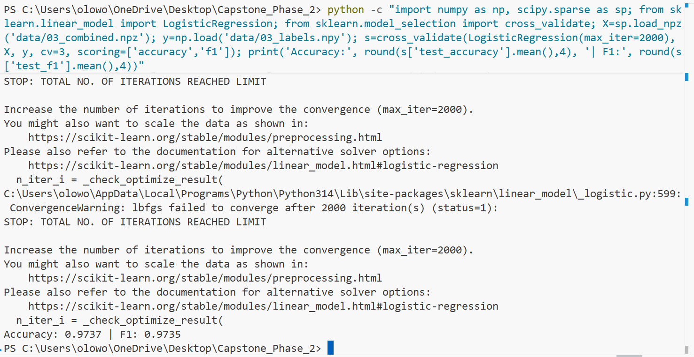
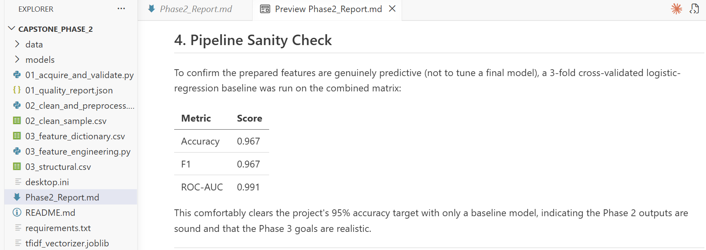

# Phase 2 Walkthrough — Running the Pipeline (with screenshots)

This document records the exact steps used to run the Phase 2 data pipeline on a
Windows machine using VS Code, including the console output produced at each stage.
It is written so the process can be reproduced from scratch.

---

## Prerequisites

- **Python 3.9+** installed and added to PATH.
- **VS Code** with the project folder opened.
- An internet connection (Stage 1 downloads the dataset).

---

## Step 0 — Open the project and a terminal in VS Code

1. In VS Code: **File → Open Folder** and open the `Capstone_Phase_2` folder.
2. Open the integrated terminal with **Ctrl + `** (or **Terminal → New Terminal**).
   The prompt should end in `Capstone_Phase_2`, confirming the terminal is pointed
   at the project folder.

Install the dependencies once:

```bash
pip install -r requirements.txt
```

---

## Step 1 — Acquire & validate the dataset

```bash
python 01_acquire_and_validate.py
```

This downloads the CEAS_08 dataset (~65 MB, first run only), validates its schema,
checks the class balance, counts duplicates and missing values, and runs a leakage
check. It writes `data/01_validated.csv` and `data/01_quality_report.json`.



**What to verify in the output:**
- 39,154 rows, 7 columns.
- Class balance ~56% phishing / 44% legitimate.
- 0 duplicate rows, 0 empty bodies.
- *Label rate by URL flag* ≈ 0.54 vs 0.57 — the URL flag does **not** give away the
  label, so there is no obvious leakage.

---

## Step 2 — Clean & preprocess the text

```bash
python 02_clean_and_preprocess.py
```

Strips HTML, normalizes characters, replaces URLs/emails with placeholder tokens,
lowercases the text, and removes duplicates revealed by normalization. Writes
`data/02_clean.csv`.



**What to verify:**
- Input 39,154 → final **34,123** rows.
- **5,031 duplicates dropped** (near-identical phishing templates) — this prevents the
  same message leaking across the train/test split later.
- In the example line, the original link now appears as the token `urltoken`, so the
  model learns "a link is present" instead of memorizing specific domains.

---

## Step 3 — Engineer the features

```bash
python 03_feature_engineering.py
```

Builds 18 interpretable structural features (link counts, urgency words, uppercase
ratio, reply-thread flag, ...) plus 5,000 TF-IDF text features, and combines them.
Writes `data/03_structural.csv`, `data/03_combined.npz`, `data/03_labels.npy`, the
feature dictionary, and the fitted vectorizer.



**What to verify:**
- Combined feature matrix of shape **34,123 × 5,018**.
- A ranked list of the strongest structural signals, led by `subject_is_reply`
  (negative correlation: replies lean legitimate in this dataset).

---

## Step 4 — Sanity check (confirm the features are predictive)

```bash
python -c "import numpy as np, scipy.sparse as sp; from sklearn.linear_model import LogisticRegression; from sklearn.model_selection import cross_validate; X=sp.load_npz('data/03_combined.npz'); y=np.load('data/03_labels.npy'); s=cross_validate(LogisticRegression(max_iter=2000), X, y, cv=3, scoring=['accuracy','f1']); print('Accuracy:', round(s['test_accuracy'].mean(),4), '| F1:', round(s['test_f1'].mean(),4))"
```

A quick logistic-regression baseline reaches **~0.97 accuracy / ~0.97 F1**, clearing
the project's 95% target before any tuning. (A `ConvergenceWarning` may print above the
result; it is harmless — it means the solver was still improving when it stopped, an
optimization detail addressed in Phase 3, not a data problem.)



---

## Outcome

Phase 2 is complete: a validated, cleaned, leakage-checked dataset of 34,123 emails has
been converted into a 5,018-feature matrix, with all artifacts saved for Phase 3. The
written report is in [../Phase2_Report.md](../Phase2_Report.md).



---

## Appendix — Issues encountered and fixes (real run log)

Documenting the snags hit during the actual run, for reproducibility:

| Symptom | Cause | Fix |
|---------|-------|-----|
| `Could not open requirements file: ... No such file or directory` | Terminal was in the wrong folder | `cd` into the project folder, or open the folder directly in VS Code |
| `requirements.txt` showed length **0** | File saved empty | Re-saved the file with contents, or installed packages by name directly |
| `No matching distribution found for install` | Command typed twice (`pip install pip install ...`) | Type the command once: `pip install -r requirements.txt` |

These are common first-run issues; none indicate a problem with the pipeline itself.
